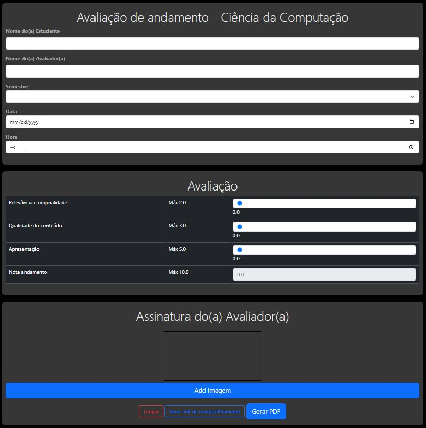

# Projeto: Remake de site/app web

Acesso: https://trabalho1-web-zeta.vercel.app/

#### Desenvolvedor(a)
Ivan Maidana da Silveira  Ciência da Computação

#### Site/app escolhido

##### Link
https://andreainfufsm.github.io/avaliatcc/andamentocc/

##### Descrição
Se trata de um site que possui inputs a serem preenchidos, possui um campo de assinatura, opções de gerar pdf do documento, seu tema e todo claro.

#### Desenvolvimento
O meu remake tenta traser algumas melhoras no site como por exemplo usando inputs do tipo range o que ao meu ver facilita o preenchimento das notas, a troca das cores por uma tema dark, a adição da funcionalidade de adicinar uma imagem da assinatura. A coleta do Conteúdo foi feita pelo navegador com boa parte dos códigos sendo reaproveito do original

#### Tecnologias
- HTML
- CSS
- Bootstrap
- Java Script
- jquery

#### Ambiente de desenvolvimento
- VS Code
- Open With Live Server

#### Referências e créditos
- chatGPT (Fiz perguntas basicas sobre coisas que eu não sabia como fazer como por exemplo uma tag que eu possa subir uma imagem local do meu computador...)
- site Bootstrap

---
Projeto entregue para a disciplina de [Desenvolvimento de Software para a Web](http://github.com/andreainfufsm/elc1090-2024a) em 2024a